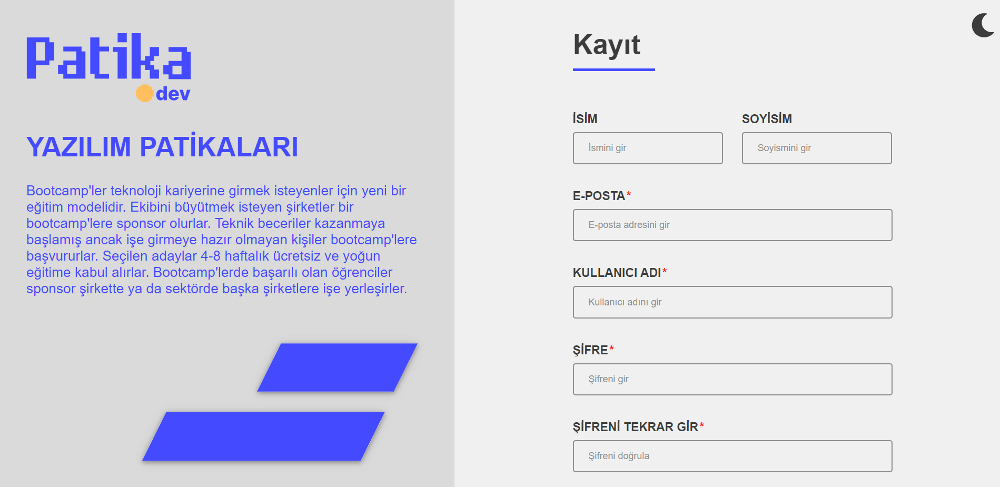
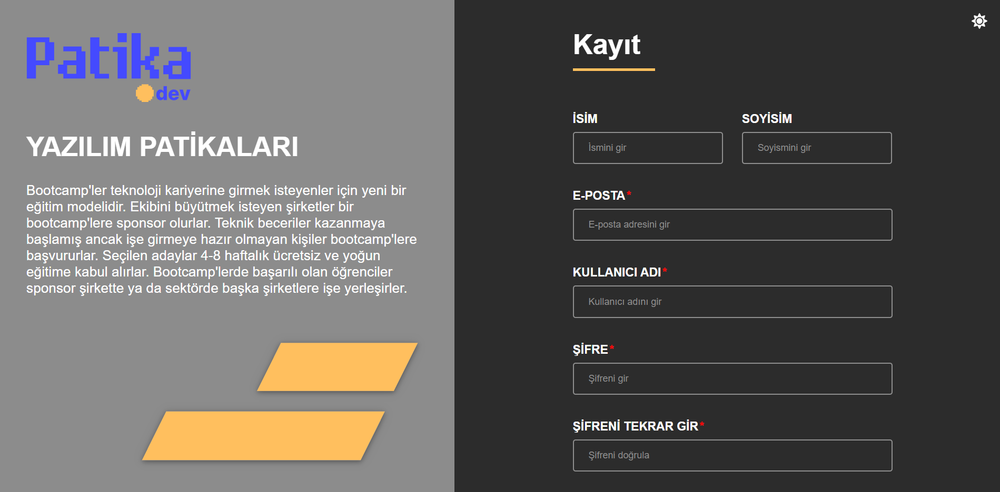

# Week 5 Project
You can find the live version of the application [here](https://react-bootcamp-week5-assignment.vercel.app/).

A register screen has been implemented in this project. In the project made using React, the register form was made with formik and yup libraries. The project has 2 different color themes as dark and light.

## Light Mode

## Dark Mode

